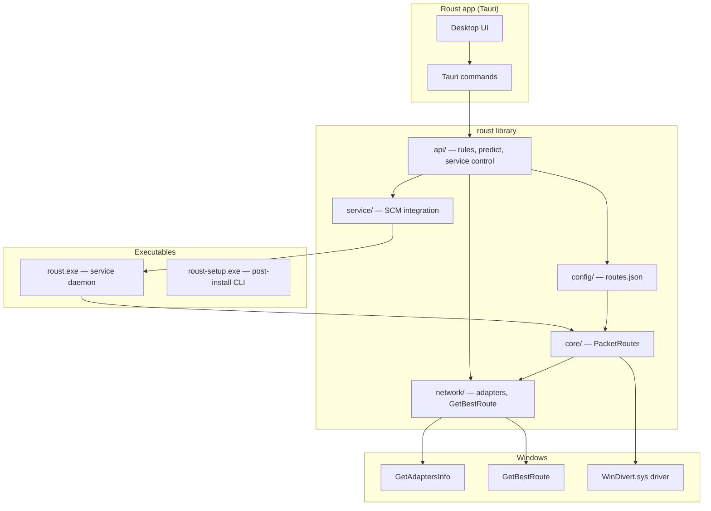

# How roust works

Technical overview of **roust** — a Windows-only packet router that steers inbound and outbound IPv4 traffic to specific network interfaces using rule-based configuration and [WinDivert](https://www.reqrypt.org/windivert.html) packet interception. Rules and service state are managed through the **Roust** desktop app (Tauri GUI); `roust.exe` runs as a Windows service.

## Purpose

roust lets you send traffic destined for certain IPv4 CIDR ranges out through a chosen NIC (Ethernet, Wi‑Fi, VPN adapter, etc.), optionally rewriting the packet’s destination IPv4 address before reinjection. Typical use cases include split routing (e.g. Iran or private IP blocks via one interface, everything else via another) without changing the Windows routing table for every prefix.

The tool does **not** replace the full TCP/IP stack. It sits in user space, captures **inbound and outbound** IPv4 packets with WinDivert, adjusts metadata (and optionally headers), and reinjects them so the kernel delivers or sends them on the interface you configured.

## High-level architecture



## Binaries and crate layout

| Artifact | Path | Role |
|----------|------|------|
| `roust.exe` | `src/main.rs` | Windows service daemon; installer hooks `--install-service` / `--uninstall-service` |
| `roust-setup.exe` | `src/bin/roust-setup.rs` | Post-install CLI: WinDivert ZIP, IP lists, user PATH |
| Roust app | `gui/` (Tauri) | User-facing UI for rules, egress prediction, service start/stop |
| Library | `src/lib.rs` | Shared `api`, `config`, `core`, `network`, `service`, `setup`, `update` |

Cargo is configured for **Windows MSVC only** (`build.rs` panics on non-Windows targets). WinDivert is linked at build time from `WinDivert-2.2.2-A/` (or `ROUST_WINDIVERT_SDK`).

### Source modules

| Module | Responsibility |
|--------|----------------|
| `api/` | Shared logic for the GUI: list/add/edit/delete rules, predict egress, service status and control |
| `config/` | `routes.json` in the install directory — rules as JSON array |
| `network/` | `GetAdaptersInfo`, `GetBestRoute`, egress prediction |
| `core/` | `PacketRouter` + WinDivert FFI and safe handle wrapper |
| `service/` | SCM registration, `--run-as-service` dispatcher, force-stop/restart |
| `update/` | Download Iran aggregated blocks and private IP lists |
| `setup/` | Installer helper: ZIP extract, PATH scripts, optional rustup |

## Configuration model

Rules live in `routes.json` beside `roust.exe` in the install directory (`Config::default_config_path`).

### Rule shape

```json
[
  {
    "cidr": "192.168.1.0/24",
    "rewrite-to": "192.168.1.1"
  }
]
```

| Field | Meaning |
|-------|---------|
| `cidr` | IPv4 CIDR block (e.g. `10.0.0.0/8`, `212.80.19.12/32`) |
| `rewrite-to` | MAC address, NIC name, or default gateway IPv4 of the target interface |

**Matching order:** Rules are scanned in array order; the **first** matching rule wins (`config::Config::find_compiled` on the in-memory compiled table at runtime).

**Validation:** Match values must be IPv4 CIDR blocks (include a `/prefix`; plain IPs and `*` are rejected). `rewrite-to` is classified as gateway IP, MAC, or NIC name.

## Managing rules and service (Roust app)

The Tauri frontend invokes `api` functions via commands in `gui/src-tauri/src/lib.rs`:

| App action | API function | Behavior |
|------------|--------------|----------|
| List rules | `list_rules` | Read `routes.json` |
| List adapters / gateways | `list_gateways` | Enumerate NICs with MAC and default gateway |
| Predict egress | `predict_route` | `GetBestRoute` for a destination IPv4 (kernel view, before roust rules) |
| Add / edit / delete rule | `add_rule`, `edit_rule`, `delete_rule` | Validate targets, save config; live reload within ~1s when service is running |
| Import rules | `import_rules_from_file` | Bulk import from JSON or line-oriented text |
| Service status | `service_status` | SCM state, install directory, version |
| Start / stop / restart | `start_service`, `stop_service`, `restart_service` | Control Windows service **Roust** |

Service registration is done by **installer.ps1** or the hidden flag `roust --install-service` (elevated). Unregister with `roust --uninstall-service`.

### IP list updates

**roust-setup** downloads Iran aggregated and private IP lists via `update::run` and `update::run_private_ips` → `iran_aggregated.json`, `ipv4.txt`, `ipv6.txt`, `ipv4_cidr.txt`, `ipv6_cidr.txt`, `private_ips.json`, etc. in the install directory.

## Packet routing pipeline (service running)

When the router runs under SCM, this is the per-packet flow:

```mermaid
sequenceDiagram
    participant App as Application
    participant Stack as Windows TCP/IP
    participant WD as WinDivert
    participant R as PacketRouter
    participant CFG as Config

    App->>Stack: IPv4 packet (inbound or outbound)
    Stack->>WD: intercept (filter: ip)
    WD->>R: WinDivertRecv(packet, address)
    R->>R: outbound? match dst : match src
    R->>CFG: find_compiled(peer IP)
    alt rule matches
        CFG-->>R: gateway + optional rewrite_to
        R->>R: kernel routes installed at start (if_index from gateway map)
        opt rewrite_to set
            R->>R: outbound: patch dst; inbound: patch src
            R->>R: recalc header checksum
        end
        R->>R: WinDivertHelperCalcChecksums (when header changed)
    end
    R->>WD: WinDivertSend(packet, address)
    WD->>Stack: reinject
    Stack->>App: packet continues on chosen interface
```

### WinDivert setup

- **Filter:** `"ip"` (all IPv4/IPv6 at network layer; the router only processes IPv4 headers)  
- **Layer:** `WINDIVERT_LAYER_NETWORK` (layer 0)  
- **Buffer:** up to `WINDIVERT_MTU_MAX` bytes per packet  

### Rule application

1. **Direction** — Read `WinDivertAddress.Outbound`: outbound packets use destination matching; inbound packets use source matching (the remote peer for traffic in both directions).  
2. **Match** — `Config::find_compiled` against pre-parsed CIDR patterns.  
3. **Redirect interface** — At start, each rule’s `gateway` is resolved to `if_index` via `GetAdaptersAddresses` gateways and the IPv4 forward table (`0.0.0.0/0` per interface). Matching prefixes get `route add … via <gateway> IF <if_index>`; WinDivert does not set outbound `IfIdx`.  
4. **Optional rewrite** — If `rewrite_to` is set: outbound packets rewrite **destination**; inbound packets rewrite **source** (symmetric to split-tunnel semantics). Recompute the IPv4 header checksum.  
5. **Checksums** — `WinDivertHelperCalcChecksums` when the IPv4 header was modified.  
6. **Reinject** — **Every** packet is sent back (matched or not) so nothing is dropped.

### Shutdown

Service stop sets a shutdown flag and calls `WinDivertShutdown` on the open handle so `WinDivertRecv` unblocks. Host routes installed for rules are removed on stop.

## Network layer details

### Interface enumeration (`network/win.rs`)

Uses `GetAdaptersAddresses` (`GAA_FLAG_INCLUDE_GATEWAYS`) to collect:

- `AdapterName` → `name`  
- `Description` → `display_name`  
- `FriendlyName` → optional alias  
- `IfIndex` → `if_index` (used for host routes and route prediction)  
- First IPv4 unicast, first IPv4 gateway, MAC, coarse type (Ethernet / WiFi / Other)

### Egress prediction (`api::predict_route`)

`GetBestRoute(dest, 0, &mut MIB_IPFORWARDROW)` returns the forward interface index and next hop. That index is correlated with the adapter list for human-readable NIC output. This is the **kernel routing table** view, independent of roust rules.

## Setup and installation (`roust-setup`)

`setup::run` orchestrates:

1. **Logs directory** under the install folder  
2. **Optional Rust** — `rustup-init` if `--install-rust` or `ROUST_INSTALL_RUST` (skipped by default for end users)  
3. **WinDivert** — Download ZIP from GitHub releases (or `ROUST_WINDIVERT_ZIP_URL`), extract under install dir unless `WinDivert.dll` already exists  
4. **IP lists** — `update::run` + `update::run_private_ips` unless skipped  
5. **User PATH** — PowerShell script appends install dir (unless `--skip-path` / `ROUST_SKIP_PATH`)

**Uninstall:** `roust-setup --uninstall-path` removes the install directory from the user PATH.

## Build and dependencies

- **Link time:** `build.rs` adds `WinDivert.lib` from `WinDivert-2.2.2-A/x64` (or x86).  
- **Run time:** `WinDivert.dll` and driver must be beside `roust.exe` (setup or manual copy). Administrator rights are typically required for WinDivert.  
- **Crates:** `clap` (roust-setup only), `serde`/`serde_json`, `ipnetwork`, `windows` Win32 IP Helper APIs, `ureq` (HTTP), `zip` (setup).

## Environment variables

| Variable | Purpose |
|----------|---------|
| `ROUST_WINDIVERT_SDK` | Override path to WinDivert SDK for linking |
| `ROUST_WINDIVERT_ZIP_URL` | WinDivert ZIP URL for setup |
| `ROUST_IR_AGGREGATED_JSON_URL` | Iran IP JSON source for `update` |
| `ROUST_PRIVATE_IPS_JSON_URL` | Private IP JSON source |
| `ROUST_INSTALL_RUST` / `ROUST_SKIP_*` | Control setup steps (lists, path, windivert, rust) |
| `RUST_LOG` | Standard `env_logger` filter for verbose diagnostics (service logs to `logs/roust-service.log`) |

## Security and operational notes

- **Privileges:** WinDivert installation and capture usually require elevation.  
- **Scope:** **Inbound and outbound IPv4** at the network layer; IPv6 packets are not matched or rewritten (they pass through unchanged).  
- **Rule vs route table:** Egress prediction in the app shows Windows’ choice; the running service installs more-specific host routes for matched prefixes so egress uses the rule’s gateway/interface, which can differ from `GetBestRoute` for those IPs.  
- **Windows service:** The router runs under SCM as service **Roust**; logs go to `logs/roust-service.log` in the install directory. Install via `installer.ps1` or `roust --install-service` (admin).  
- **Traffic integrity:** Modified packets get checksum recalculation; unmodified packets pass through unchanged.

## Example end-to-end workflow

1. Run **roust-setup** or the installer wizard (WinDivert, IP lists, PATH, service registration).
2. Open the **Roust** app — use **Predict** to see what Windows would do for a destination IP.
3. Add rules (CIDR blocks or import a file) targeting each interface’s default gateway.
4. Start the service from the app. Rules reload automatically when `routes.json` changes.

## Migration notes

- Old configs used `"nic": "Ethernet"`; that field is rejected with a migration message. Use `"rewrite-to"` with a MAC address, NIC name, or gateway IP.
- Old match fields `"ip"`, `"ip-or-cidr"`, plain IPs, and `"*"` are no longer accepted. Use `"cidr"` with an explicit prefix (e.g. `8.8.8.8/32` for a single host).

## Related files

- User-facing install guide: [README.md](../README.md)  
- WinDivert SDK (vendored): `WinDivert-2.2.2-A/`  
- CI build: `.github/workflows/windows-build.yml`  
- Sample private ranges: [private_ips.json](../private_ips.json)
