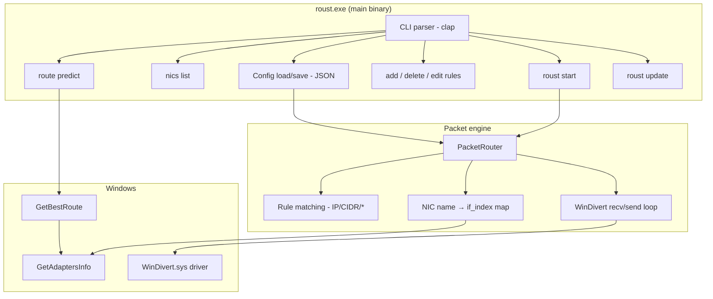

# How roust works

Technical overview of **roust** — a Windows-only CLI that routes inbound and outbound IPv4 traffic to specific network interfaces using rule-based configuration and [WinDivert](https://www.reqrypt.org/windivert.html) packet interception.

## Purpose

roust lets you send traffic destined for certain IP addresses (or CIDR ranges) out through a chosen NIC (Ethernet, Wi‑Fi, VPN adapter, etc.), optionally rewriting the packet’s destination IPv4 address before reinjection. Typical use cases include split routing (e.g. Iran or private IP blocks via one interface, everything else via another) without changing the Windows routing table for every prefix.

The tool does **not** replace the full TCP/IP stack. It sits in user space, captures **inbound and outbound** IPv4 packets with WinDivert, adjusts metadata (and optionally headers), and reinjects them so the kernel delivers or sends them on the interface you configured.

## High-level architecture



## Binaries and crate layout

| Artifact | Path | Role |
|----------|------|------|
| `roust.exe` | `src/main.rs` | Main CLI: rules, NIC listing, route prediction, `start` / `update` |
| `roust-setup.exe` | `src/bin/roust-setup.rs` | Post-install: WinDivert ZIP, IP lists, user PATH |
| Library | `src/lib.rs` | Shared `setup` and `update` modules |

Cargo is configured for **Windows MSVC only** (`build.rs` panics on non-Windows targets). WinDivert is linked at build time from `WinDivert-2.2.2-A/` (or `ROUST_WINDIVERT_SDK`).

### Source modules

| Module | Responsibility |
|--------|----------------|
| `cli/` | Clap command tree and global `--config` |
| `config/` | `routes.json` (or `%ProgramData%\roust\routes.json`) — rules as JSON array |
| `network/` | `GetAdaptersInfo`, `GetBestRoute`, egress prediction |
| `core/` | `PacketRouter` + WinDivert FFI and safe handle wrapper |
| `update/` | Download Iran aggregated blocks and private IP lists |
| `setup/` | Installer helper: ZIP extract, PATH scripts, optional rustup |

## Configuration model

Rules live in `routes.json`. Default resolution order:

1. `%ProgramData%\roust\routes.json` if it exists  
2. Otherwise `./routes.json` in the current working directory (created on first `add` if missing)

You can override with `--config <path>`.

### Rule shape

```json
[
  {
    "ip": "192.168.1.0/24",
    "nic": "Ethernet",
    "rewrite_to": "10.0.0.1"
  }
]
```

| Field | Meaning |
|-------|---------|
| `ip` | Exact IPv4/IPv6 string, CIDR (e.g. `10.0.0.0/8`), or `*` (match all) |
| `nic` | Adapter **name** or **description** from `GetAdaptersInfo` (case-insensitive) |
| `rewrite_to` | Optional: replace destination IPv4 in the packet before reinject |

**Matching order:** Rules are scanned in array order; the **first** matching rule wins (`config::Config::find_compiled` on the in-memory compiled table at runtime).

**Validation:** CIDR and single IPs are parsed with `ipnetwork` / `std::net::IpAddr`; `rewrite_to` must parse as an IP.

## CLI commands

### Network discovery

- **`roust nics list`** — Enumerates adapters via `GetAdaptersInfo`: name, description, MAC, type, primary IPv4.

### Routing table (no WinDivert)

- **`roust route predict --dest <ipv4>`** — Calls `GetBestRoute` for the destination and prints `if_index`, next hop, and matched NIC name/description. This is what Windows would use **before** any roust rule is applied.

### Rule management

Subcommands `add`, `delete`, `edit` use a shared `Rule` action with flags:

- `--ip` — Single destination or CIDR  
- `--nic` / `--dest` — Target interface (CLI uses `nic` in code)  
- `--rewrite-to` — Optional destination rewrite  
- `--file` — Bulk import from `.json` array or line-oriented text file  

On `add`, the NIC name is validated against live interfaces.

### Router lifecycle

| Command | Behavior today |
|---------|----------------|
| `roust start` | Loads config, builds `PacketRouter::with_interfaces`, blocks in WinDivert loop until **Ctrl+C** |
| `roust stop` | Informational only; stop the foreground `start` process |
| `roust restart` | Runs `start` again (no detached daemon) |
| `roust status` | Informational; Windows Service integration is planned |

### IP list updates

- **`roust update`** — Downloads Iran aggregated JSON from ipverse (overridable via `ROUST_IR_AGGREGATED_JSON_URL`), writes `iran_aggregated.json`, `ipv4.txt`, `ipv6.txt`, `ipv4_cidr.txt`, `ipv6_cidr.txt` in the **current working directory**.

Setup also downloads **private** lists via `update::run_private_ips` → `private_ips.json`, `private_ips.txt`, `private_ips_cidr.txt`.

## Packet routing pipeline (`roust start`)

When the router runs, this is the per-packet flow:

```mermaid
sequenceDiagram
    participant App as Application
    participant Stack as Windows TCP/IP
    participant WD as WinDivert
    participant R as PacketRouter
    participant CFG as Config

    App->>Stack: IPv4 packet (inbound or outbound)
    Stack->>WD: intercept (filter: ip)
    WD->>R: WinDivertRecv(packet, address)
    R->>R: outbound? match dst : match src
    R->>CFG: find_compiled(peer IP)
    alt rule matches
        CFG-->>R: nic + optional rewrite_to
        R->>R: set address.Network.IfIdx from NIC map
        opt rewrite_to set
            R->>R: outbound: patch dst; inbound: patch src
            R->>R: recalc header checksum
        end
        R->>R: WinDivertHelperCalcChecksums (when header changed)
    end
    R->>WD: WinDivertSend(packet, address)
    WD->>Stack: reinject
    Stack->>App: packet continues on chosen interface
```

### WinDivert setup

- **Filter:** `"ip"` (all IPv4/IPv6 at network layer; the router only processes IPv4 headers)  
- **Layer:** `WINDIVERT_LAYER_NETWORK` (layer 0)  
- **Buffer:** up to `WINDIVERT_MTU_MAX` bytes per packet  

### Rule application

1. **Direction** — Read `WinDivertAddress.Outbound`: outbound packets use destination matching; inbound packets use source matching (the remote peer for traffic in both directions).  
2. **Match** — `Config::find_compiled` against pre-parsed rule patterns (exact, CIDR, or `*`).  
3. **Redirect interface** — Look up `nic` in a map built at start: adapter name and display name (lowercase) → `if_index` from `GetAdaptersInfo`. Set `WinDivertAddress` network union field `if_idx` for reinject on the same path (inbound vs outbound).  
4. **Optional rewrite** — If `rewrite_to` is set: outbound packets rewrite **destination**; inbound packets rewrite **source** (symmetric to split-tunnel semantics). Recompute the IPv4 header checksum.  
5. **Checksums** — `WinDivertHelperCalcChecksums` when the IPv4 header was modified.  
6. **Reinject** — **Every** packet is sent back (matched or not) so nothing is dropped.

### Shutdown

A console Ctrl+C handler sets a global atomic flag and calls `WinDivertShutdown` on the open handle so `WinDivertRecv` unblocks. On exit, the router prints separate routed vs passed-through counts for inbound and outbound.

## Network layer details

### Interface enumeration (`network/win.rs`)

Uses legacy `GetAdaptersInfo` to collect:

- `AdapterName` → `name`  
- `Description` → `display_name`  
- `Index` → `if_index` (used by WinDivert and route prediction)  
- MAC, first IPv4, coarse type (Ethernet / WiFi / Other)

### Egress prediction (`route predict`)

`GetBestRoute(dest, 0, &mut MIB_IPFORWARDROW)` returns the forward interface index and next hop. That index is correlated with the adapter list for human-readable NIC output. This is the **kernel routing table** view, independent of roust rules.

## Runtime bootstrap

On every `roust` launch, `main` ensures in the **current directory**:

- `settings.json` — created as `{}` if missing  

This file is a placeholder for future persistence; the active routing config is `routes.json` (or the path passed via `--config`).

## Setup and installation (`roust-setup`)

`setup::run` orchestrates:

1. **Logs directory** under the install folder  
2. **Optional Rust** — `rustup-init` if `--install-rust` or `ROUST_INSTALL_RUST` (skipped by default for end users)  
3. **WinDivert** — Download ZIP from GitHub releases (or `ROUST_WINDIVERT_ZIP_URL`), extract under install dir unless `WinDivert.dll` already exists  
4. **IP lists** — `update::run` + `update::run_private_ips` unless skipped  
5. **User PATH** — PowerShell script appends install dir (unless `--skip-path` / `ROUST_SKIP_PATH`)

The Inno Setup wizard (`installer/roust.iss`) installs to `C:\Program Files\roust`, runs staging, and bundles the same flow.

**Uninstall:** `roust-setup --uninstall-path` removes the install directory from the user PATH.

## Build and dependencies

- **Link time:** `build.rs` adds `WinDivert.lib` from `WinDivert-2.2.2-A/x64` (or x86).  
- **Run time:** `WinDivert.dll` and driver must be beside `roust.exe` (setup or manual copy). Administrator rights are typically required for WinDivert.  
- **Crates:** `clap`, `serde`/`serde_json`, `ipnetwork`, `windows` Win32 IP Helper APIs, `ureq` (HTTP), `zip` (setup).

## Environment variables

| Variable | Purpose |
|----------|---------|
| `ROUST_WINDIVERT_SDK` | Override path to WinDivert SDK for linking |
| `ROUST_WINDIVERT_ZIP_URL` | WinDivert ZIP URL for setup |
| `ROUST_IR_AGGREGATED_JSON_URL` | Iran IP JSON source for `update` |
| `ROUST_PRIVATE_IPS_JSON_URL` | Private IP JSON source |
| `ROUST_INSTALL_RUST` / `ROUST_SKIP_*` | Control setup steps (lists, path, windivert, rust) |
| `RUST_LOG` | Standard `env_logger` filter for verbose diagnostics |

## Security and operational notes

- **Privileges:** WinDivert installation and capture usually require elevation.  
- **Scope:** **Inbound and outbound IPv4** at the network layer; IPv6 packets are not matched or rewritten (they pass through unchanged).  
- **Rule vs route table:** `route predict` shows Windows’ choice; `start` overrides egress for matched destinations via WinDivert `if_idx`, which can differ from `GetBestRoute` for those IPs.  
- **No background service yet:** One foreground process; stopping is Ctrl+C in that terminal.  
- **Traffic integrity:** Modified packets get checksum recalculation; unmodified packets pass through unchanged.

## Example end-to-end workflow

```powershell
# 1. List adapters and pick a NIC name
roust nics list

# 2. See what Windows would do without roust
roust route predict --dest 8.8.8.8

# 3. Add rules (file or single IP)
roust add --file private_ips.json --nic "Wi-Fi"
roust add --ip 2.144.0.0/14 --nic "Ethernet"

# 4. Start interception (admin PowerShell)
roust start

# 5. Refresh Iran list files in cwd
roust update
```

## Planned / partial features

- Windows Service for `stop` / `status` / `restart` without a foreground terminal.  
- Deeper use of `settings.json` for state beyond routing rules.  
- CLI help examples reference `roust ip dest …` style commands; the implemented surface uses `add` / `delete` / `edit` with `--ip` and `--nic` flags (see `src/cli/mod.rs`).

## Related files

- User-facing install guide: [README.md](../README.md)  
- WinDivert SDK (vendored): `WinDivert-2.2.2-A/`  
- CI build: `.github/workflows/windows-build.yml`  
- Sample private ranges: [private_ips.json](../private_ips.json)
